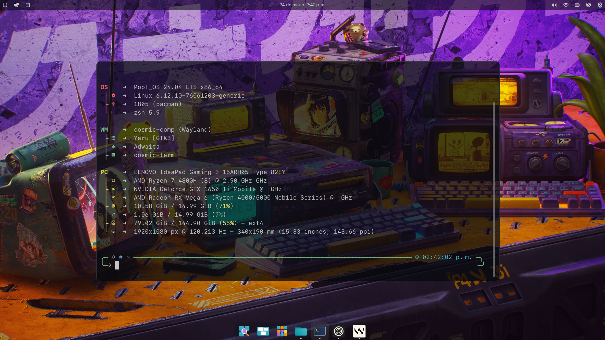

# Dotfiles

> Configuration of software I personally use for software development

*Cosmic DE with cosmic-term and fastfetch*

**WARNING:** it's for me and myself only,
I don't recommend to run it on your own machines.

If you're not me (lol), just clone this repository and
poke into configuration files (it's in `config` directory!).

## How it works?

This repository contains:

- `config` -- a bunch of configuration files and templates. Main directory here
- `wallpaper.png` -- a wallpaper
- `tools`
   - `render` -- tool to render templates into configuration files

Itself, repository should be placed somewhere in your home directory,
and after running `update` it will place rendered configuration files
into your home directory.
